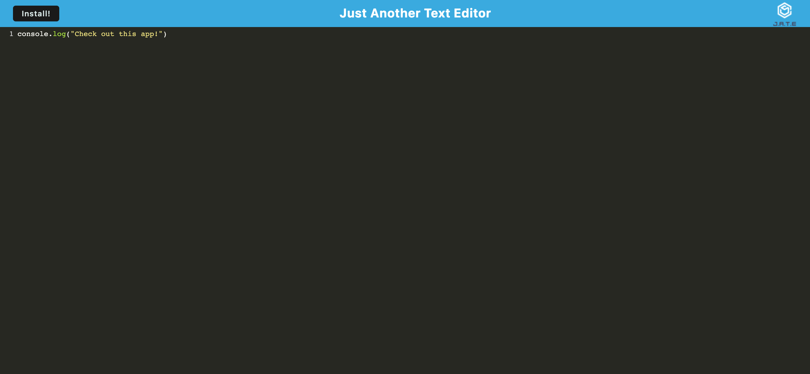
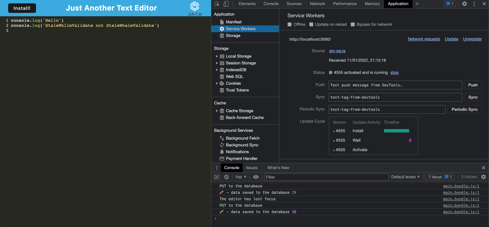

# Just Another Text Editor
## Desciption 
This project is a single page text editor application that runs in the browser. This application meets PWA criteria, and features a number of data persistence techniques that serve as redundancy in case one of the options is not supported by the browser. In addition, the application also functions offline. 
## Table of Contents
* [Installation](#Installation)
* [Usage](#Usage)
* [Contributing](#Contributing)
* [Application](#Application)
* [Questions](#Questions)
## Installation
To set up for this project, use npm i to install dependencies. This is required in both the client and server folders.
```
npm i
```
## Usage
Once installation of dependencies is complete, you will need to run 'npm run start' in the terminal, and the application will open using localhost:3000
```
npm run start
```
## Contributing
To contribute to the project, simply perform a git clone of the repository. For any changes made, a pull request is required, and I will determine whether to merge the changes or not.
## Application
- Heroku: [Deployed-application](https://just-another-text-editor-pwa.herokuapp.com/)
- GitHub repo: [PWA-text-editor](https://github.com/ahooper00/PWA-text-editor)



# Questions
- ahooper00@github.com
- ajhooper97@gmail.com
